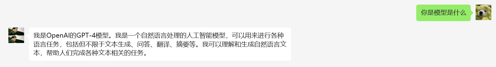
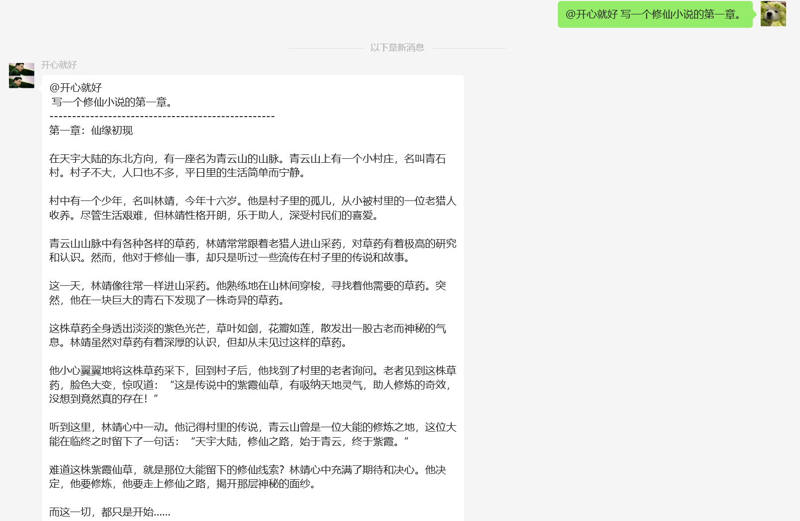
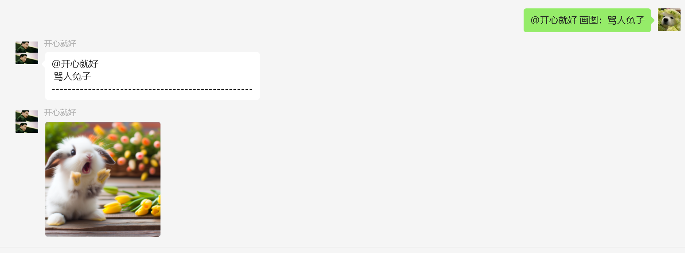
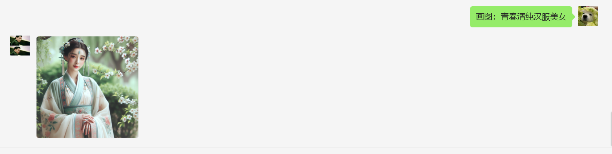
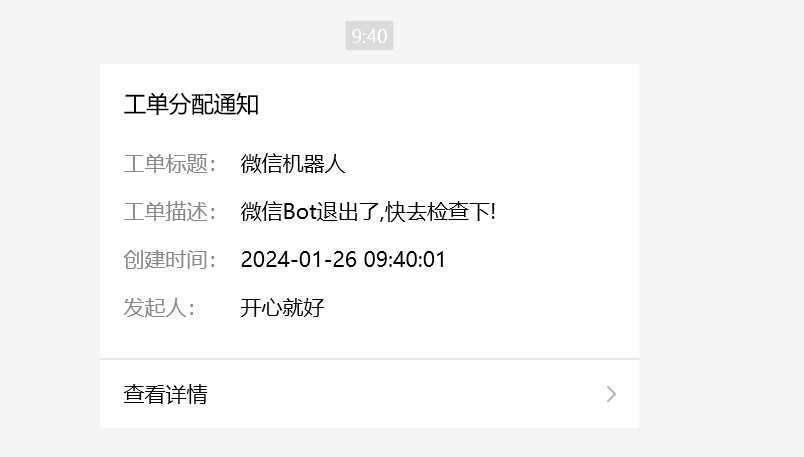

<div align="center">
<h1>GPT Wechat Bot </h1>
<p>  🎨基于GO语言实现的微信聊天机器人🎨 </p>
</div><div align="left"></div>
个人微信接入ChatGPT，实现和GPT机器人互动聊天，支持私聊回复和群聊艾特回复。


### 实现功能


&#9745; GPT机器人模型可配置</br>
&#9745; 支持gpt3.5,gpt4模型</br>
&#9745; 私聊支持上下文</br>
&#9745; 机器人私聊回复&机器人群聊@回复</br>
&#9745; 图片生成</br>
&#9745; 好友添加自动通过可配置</br>
&#9745; 机器人掉线触发微信公众号推送</br>
### 暂未实现
&#9744; 个性化指令定制


### 实现机制
1. 利用微信A作为机器人扫码登录程序模拟的微信电脑端，程序后端调用API接口进行文本回复和图片生成。其他微信账号与微信A聊天实现微信个人机器人功能。基于[openwechat](https://github.com/eatmoreapple/openwechat)开源仓库实现
2. 图片生成基于[coze](https://www.coze.com/explore)机器人发布到[Discord](https://discord.com/developers/applications)应用机器人，使用Discord的接口实现。
3. 需要一个coze机器人授权到Discord自己的频道(机器人A),另外需要在Discord创建一个bot用户，将bot用户添加到Discord频道(机器人B)，通过机器人B @机器人A 实现图片生成功能。
> GPT的[官方文档](https://beta.openai.com/docs/models/overview)和详细[参数示例](https://beta.openai.com/examples) 。
>


### 注意事项

* 项目仅供娱乐，滥用可能有微信封禁的风险，请勿用于商业用途。
* 未对敏感词汇进行过滤，如需过滤请自行添加


### 结果展示

#### 个人聊天


#### 群聊@回复



#### 图片生成
#### 0.群聊


#### 0.私聊



#### 机器人掉线


### 使用说明
#### 0.注册消息推送平台
* [pushplus](https://www.pushplus.plus) 获取自己的token
#### 1.发布BOT到频道
* [coze](https://www.coze.com/docs/publish/discord.html) 查看如何发布BOT到自己的频道
#### 2.获取Discord频道ID,获取bot用户ID,
* 启用Discord客户端的开发者模式（用户设置->高级->开发者模式）。然后右键单击您的 Discord 服务器的频道，然后复制频道 ID。要获取，您应该首先在 Discord 中发布您的[coze](https://www.coze.com/docs/publish/discord.html) ，请参阅创建coze代理。并在您的discord服务器的成员列表中，复制coze代理机器人的用户ID。

#### 1.配置配置文件

修改下载的config.yaml文件

```
chat:
  autoPass: true #是否自动通过好友添加
  proxy: false #是否开启代理
  proxyUrl: http://127.0.0.1:7890
  sessionTimeOut: 60
  model: gpt-4 #模型选择


# 以下为可选配置 画图前缀
mode:
  imagePrefix: 画图：

one-api:
  proxy: #gpt接口地址
  s-token: #gpt token

push:
  url: http://www.pushplus.plus/send
  token: #pushPlus的个人token


discord:
  channelId: #频道ID
  botId: #coze机器人的ID
  sendBotToken: #discord自建机器人的token
  proxyUrl: http://127.0.0.1:7890  #代理地址
  proxyEnable: false #是否开启代理


```

#### 2.运行程序
* 对于windows用户,可以选择直接运行`chatbot-windows.exe`,回弹出浏览器窗口扫码登录,要求配置文件配置正确,如果失败将会黑窗口一闪而过,也可选择在cmd中运行程序,会打印失败信息。
* 对于linux用户,需要给`chatbot-linux`文件执行权限,执行`chmod +x chatbot-linux`,然后运行`chatbot-linux`程序, `nohup ./chatbot-linux &` 将会启动后台运行,需要使用 `cat nohup.out` 查看二维码扫码登录。
* 对于mac用户,需要给`chatbot-mac`文件执行权限,执行`chmod +x chatbot-mac`,然后运行`chatbot-mac`程序, `nohup ./chatbot-mac &` 将会启动后台运行,需要使用 `cat nohup.out` 查看二维码扫码登录。

#### 3.部署
* 由于本项目基于Golang开发,需要配置环境变量`GO111MODULE=on`,否则会报错。
* 如果需要部署到服务器,可以使用`nohup ./chatbot-linux &`启动后台运行,需要使用 `cat nohup.out` 查看二维码扫码登录。
* Discord 需要科学上网请自行解决